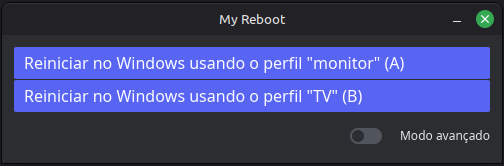
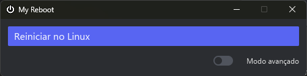
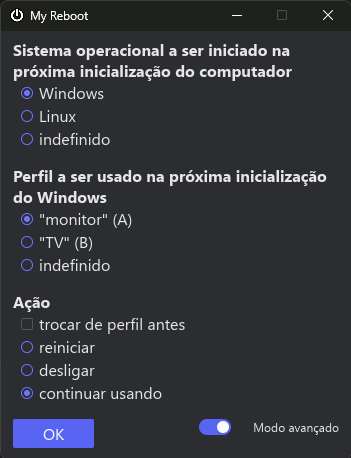

# My Reboot

## Why I developed this?

I had a dual-boot PC where I used mostly Linux, and Windows were used for gaming. I wanted
to play games on my TV, so I connected the TV to my PC. With this configuration, the boot
screens, including the GRUB menu, were displayed on the TV. It was not practical to switch
the operating systems, because my TV was not always on, and it was on the living room, while
the PC was at the office. I couldn't find any way to configure the boot screens to display
on the monitor.

So I developed this application, which has a GUI and can also be used as a CLI. In addition
to making it easier to switch the operating systems, it also sets which displays Windows
will use (the TV on my living room or the monitor in the office) when booted.

On Linux, its GUI displays two buttons that configure GRUB to boot Windows on the
next reboot, configures which displays Windows will use, and then starts the reboot process:



On Windows, the GUI shows a single button to set GRUB to boot Linux and to start the reboot
process:



The GUI also has an "advanced" mode on both OSes, where I can further choose what to do:



All actions are also available as command line arguments.

By now, its GUI and CLI are all in Brazilian Portuguese.

## Installation

### On Windows
Open PowerShell and execute `.\install.ps1`.

### On Linux
Open a terminal and execute `./install.sh`.

## Configuration
After installing on each operating system, execute `my-reboot configure`.
Additionally, GRUB must also be configured. Follow the instructions [here](GRUB-CONFIGURATION.md).

## Development
It depends on[`just`](https://just.systems/man/en/installation.html)

```bash
just --list
```
